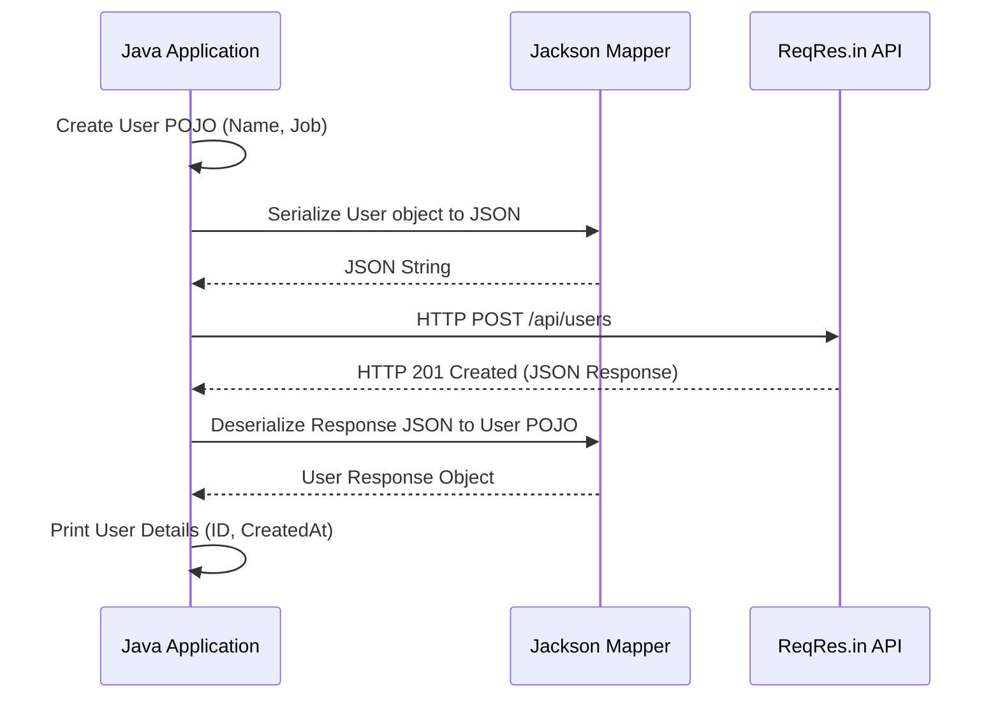

# NK Java HTTP Client 🚀

[](https://www.oracle.com/java/)
[](https://maven.apache.org/)
[](https://opensource.org/licenses/MIT)

A modern Java demonstration project showcasing the power of the native **java.net.http.HttpClient** (introduced in Java 11). This project illustrates how to perform RESTful API operations, manage headers, and handle JSON serialization/deserialization using the **Jackson** library.

---

## 🏗️ Architecture & Workflow

### Overview
The application acts as a client that communicates with the [ReqRes.in](https://reqres.in/) dummy API. High-level flow involves:
1. Creating a POJO (Plain Old Java Object).
2. Serializing the POJO to JSON using Jackson.
3. Sending the JSON via a POST request.
4. Receiving and Deserializing the JSON response back into a Java object.

### 📊 Sequence Diagram: POST User Flow


---

## ✨ Key Features

- **Native HttpClient**: No need for Apache Commons or OkHttp for basic REST needs.
- **Fluent API**: Utilizes the builder pattern for `HttpRequest` and `HttpClient`.
- **JSON Automation**: Integrated with `jackson-databind` for seamless object-to-json mapping.
- **Error Handling**: Comprehensive try-catch blocks for network and parsing exceptions.
- **CRUD Examples**: Ready-to-use examples for GET and POST requests.

---

## 📂 Project Structure

```text
JavaHttpClient/
├── src/main/java/
│   ├── GETCallAPI/
│   │   └── GETAPITest.java    # Demonstrates basic GET requests
│   └── POSTCallAPI/
│       ├── POSTCallTest.java  # Demonstrates POST flow with Serialization
│       └── User.java          # POJO for User data
├── pom.xml                    # Maven dependencies (Jackson, etc.)
└── .gitignore                 # Excludes build/IDE artifacts
```

---

## 🚀 Getting Started

### Prerequisites
- **JDK 11** or higher.
- **Maven 3.6+**.

### Installation
1. Clone the repository:
   ```bash
   git clone https://github.com/karanAtreya1986/nk_java_http_client.git
   cd nk_java_http_client
   ```

2. Build the project:
   ```bash
   mvn clean install
   ```

### Running Tests
- To run the **GET** example:
  ```bash
  mvn exec:java -Dexec.mainClass="GETCallAPI.GETAPITest"
  ```
- To run the **POST** example:
  ```bash
  mvn exec:java -Dexec.mainClass="POSTCallAPI.POSTCallTest"
  ```

---

## 🛠️ Built With
- [Java 11 HttpClient](https://openjdk.org/groups/net/httpclient/intro.html) - The HTTP client used.
- [Jackson](https://github.com/FasterXML/jackson) - For JSON processing.
- [ReqRes](https://reqres.in/) - Hosted REST API for testing.

---

## 📝 License
This project is licensed under the MIT License - see the LICENSE file for details.

---
Created with ❤️ by [Karan Atreya](https://github.com/karanAtreya1986)
